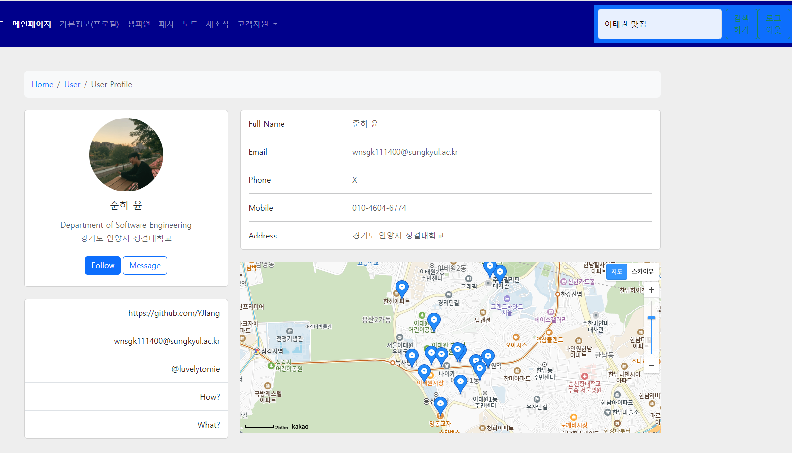
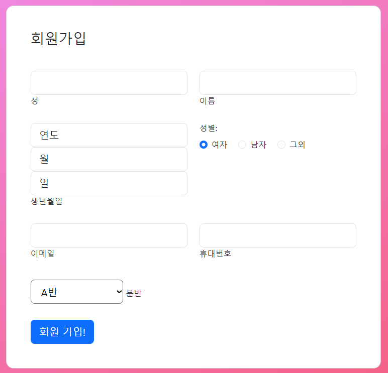
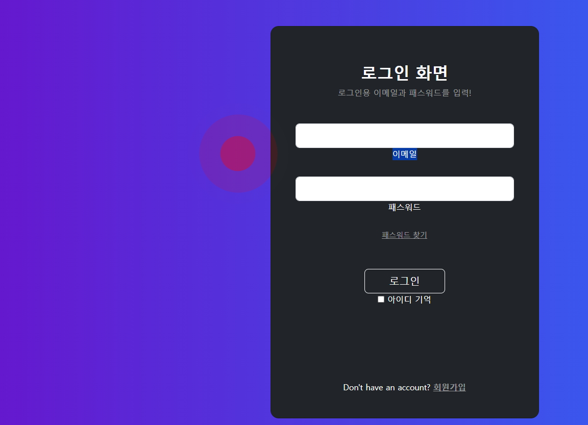
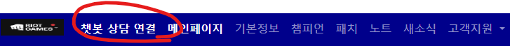
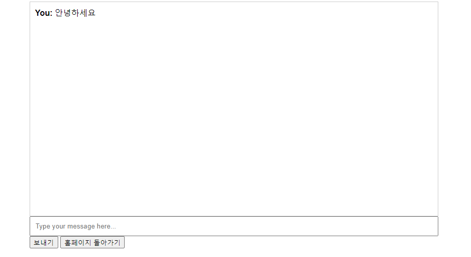

# HTML 프로젝트 - 깃허브

20211001 윤준하의 새로운 시작! 웹 서비스 개발의 세계로 떠나보아요~

## Getting Started

This project is a starting point for a Web application.

- [프로젝트 메인 주소](https://github.com/YJlang/WEB_MAIN_20211001)

## 수업 진행 상황

### 2주차 수업 : 메인화면 개발 완료!
- 문제 포함 : 데이터 수정 - 기존 색상 변경 완료

### 3주차 수업 : 부트스트랩 적용 완료!
- 문제 포함 : 네비 드랍다운 메뉴 하이퍼 링크 수정 완료, 테이블 수정 완료

### 4주차 수업 : 자바스크립트 적용 완료!
- 문제 포함 : search.js의 식별자 변경 완료

### 5주차 수업 : 자바스크립트로 팝업창 띄우기 완료!
- 문제 포함 : 공백 및 비속어 5개 필터링 제한 구현 완료 - google_search.js

### 6주차 수업 : 총선

### 7주차 수업 : 부트스트랩 로그인 폼 프론트 구현 완료!
- 문제 포함 : index_login.html <head>태그 정리 완료

### 8주차 수업 : 공백검사 및 XSS 공격 방어 코드 구현 완료!
- 문제 포함 : 로그인 입력 길이, 입력 패턴 제한 구현 완료 - login.js/search_input()

### 9주차 수업 : 중간고사

### 10주차 수업 : 쿠키 생성 및 브라우저 전송 함수 구현 완료!
- 문제 포함 : 로그인 카운트 및 3회 실패 시 락 구현 완료 - login.js

### 11주차 수업 : 대체 공휴일

### 12주차 수업 : 쿠키와 세션의 차이점 구분 후 세션 구현하기!
- 문제 포함 : 로그아웃 시 세션 삭제 및 5분 후 자동 로그아웃 기능 구현 완료 - return_logout.js

### 13주차 수업 : 객체를 이용한 세션 구현 및 회원가입 구현 완료!
- 문제 포함 : session_join_get() 함수 추가 구현 완료 - session.js, index_join.html

### 보강주차 수업 : 카카오맵 API와 부트스트랩 프로필 템플릿을 이용한 프로필 구현 완료!
- 문제 포함 : 개인사진 변경 완료, 맛집 검색 기능 및 마커 구현 완료 - map.js
- 세션을 이용한 로그인 페이지 접근 제한 구현 완료 - session.js/profile_access();

## 추가 구현 List

### 1. login.html에 마우스 클릭 이벤트 발생 구현!
- click_animaion.js >> 모든 페이지에 연동 가능

### 2. 회원가입 검사 강화 완료!
- join.html, join.js, session.js
- 성 이름 유효성 검사: 성과 이름이 한글만 포함되도록 유효성 검사를 추가했습니다.
- 생년월일 드롭다운 메뉴: 생년월일 입력 필드를 드롭다운 메뉴로 변경했습니다. >> 생년월일 필드 변경으로 각각 value 저장
- 폼 제출 전 유효성 검사: 입력 값에 대한 유효성 검사를 강화했습니다.

### 3. 상담용 텍스트 기반 ChatBot 구현 완료!! (OpenAI API 사용, Node.js아님, 프론트단에서만 최대한 구현, GPT3.5터보모델)
- chatbot.html, chatbot.js
- 전송 요청 GET방식 사용(OpenAI 서버 요청 방식)
- 간단한 채팅전용 UI적용 (UI벤치마킹 : Uchat.ch)

###

